# [TUTORIAL VIDEO](https://www.youtube.com/watch?v=UjhFbq4uU2Y) 

## Dalam kasus ini pake DUCKDB
cara running di GITBASH: duckdb md: [nama DB]

### SEQUENCE dalam Jalannya Script SQL
FROM
→ WHERE          ❌ (belum ada aggregation)
→ GROUP BY
→ AGGREGATE      (MEDIAN, SUM, dll baru dihitung di sini)
→ HAVING         ✅ (boleh pakai aggregation)
→ SELECT
→ ORDER BY 
**INGAT, kalu ada Aggregate, func, gunakan HAVING. Karena SEquence nya WHERE DULU baru aggregate.** 
**Makae sql tanya kok gak ada aggregate func nya. maka error**

## EDA
Business analyst dan market analys adalah client dari DATA ENGINEER
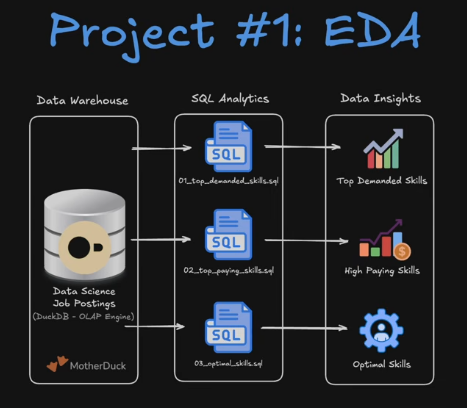

Ketika kita ngerti end goal nya maka kita akan bisa memahami arsitektur untuk client kita

Di akhir video objektif nya adalah
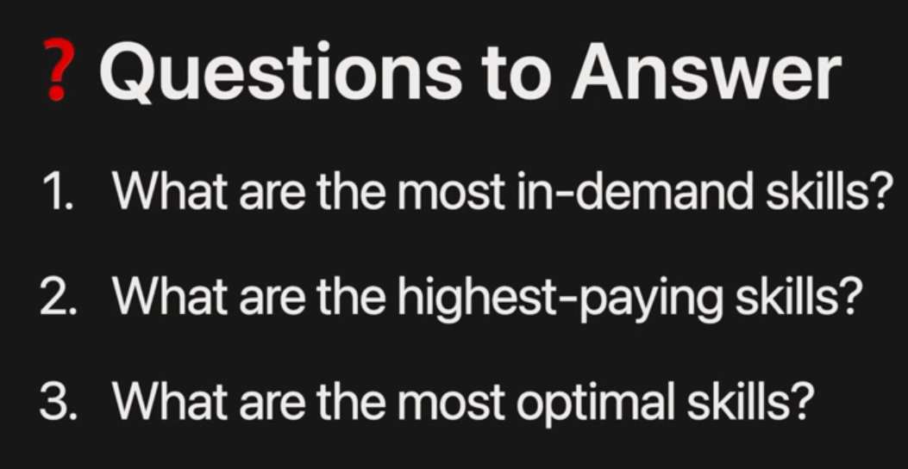

## ERD
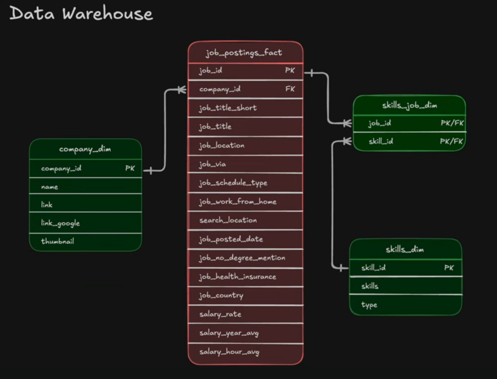

## GIT Setup **Kalo bingung bisa lihat di menit 5.30..**
### Kalo push file origin
1. git add . (kalo mau semua file) atau git push [nama file]
2. git commit -m "Infokan apa yg mau di push"
3. git push untuk push file ke repo
**_Setiap kali ada update ulangi langkah 1-3_**
3. git status untuk lihat status nya apakah sudah di push

**FYI, bisa juga liat Source Control di panel paling kiri untuk lihat apa aja**
### Contoh command nya
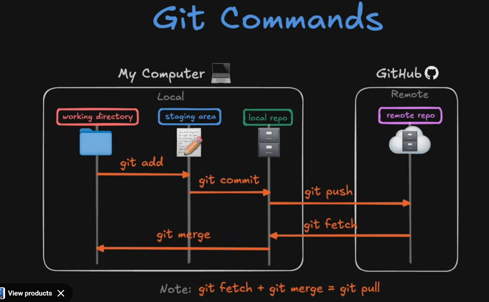

### Git pull
1. Buat repo di github
2. copass link nya
3. di terminal git remote add origin [link nya]
4. git push -u origin main (-u artinya upstream)
5. git fetch
6. git pull

## Git Setup part 2 (hour 11.52)
### Git branch
1. git branch __untuk cek branch apa saja__
2. git branch [nama branch] __untuk buat nama branch__
3. git switch [nama branch] __switch ke branch yang mau dikerjakan__
4. git branch -d [nama branch] __delete branch (pastikan sudah di branch yg lain sebelum delete branch itu)__
5. **Jika mau buat dan langsung siwtch**
git switch -c [nama branch] 

**_Kalo misal edit code di GitHub nya langsung, di local tidak akan terupdate_**
**_Untuk update maka perlu git pull aja_**

### DDL & DML
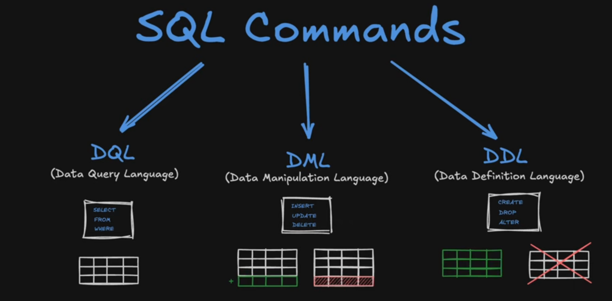

### SOURCE TBL
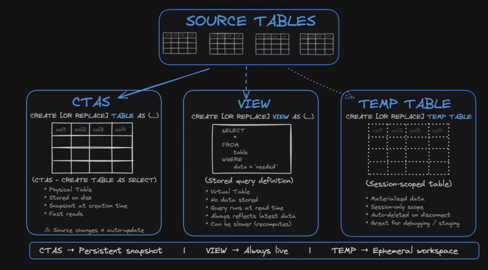
A. CTAS:
- untuk membuat table 
- stored on disk
- snapshot at creation time
- fast reads
- source change & autoupdate

B. VIEW:
- stored query definition
- virtual table
- not data stored

C. TEMP TABLE
- Sssion scoped table
- Materialized data
- Seasoning scope
- aUTODELETE on disconnect

[Nek bingung ini file e](Lessons/1.22/1.22_DD_DML_pt2.sql)
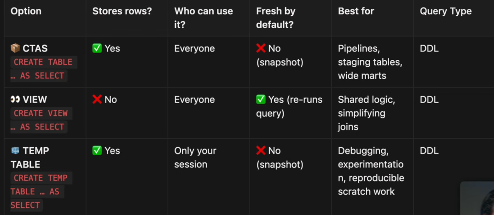

-VIEW kalo butuh latest data untuk data
-CTAS kalo fast read, same result
-TEMP untuk testing debugging

#### **[File untuk pipeline](Lessons\1.24\1.24_priority_tables_snapshot.sql)**
Diagaram pipeline nya kayak gini
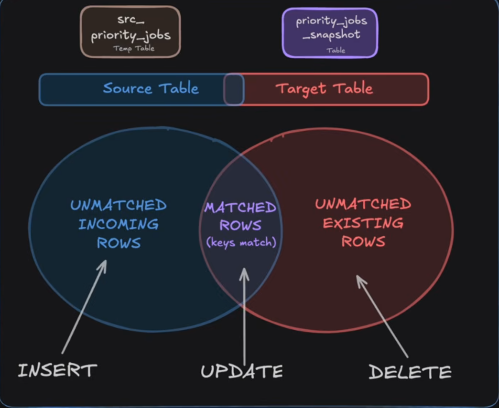

## Data Modeling
Kenapa Data Modeling penting?
- Untuk menyeragamkan design agar kita bisa akses data lebih cepat
- lebih mudah di analisa dan di aggregate
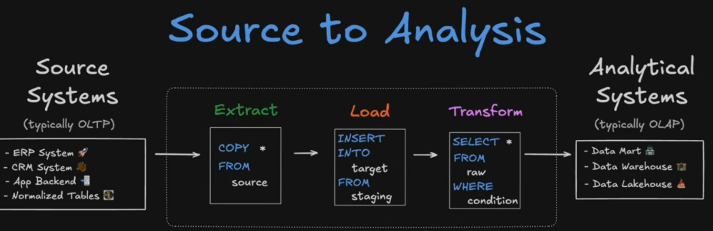

ERP 
- fungsi untuk run entire bisnis berfokus pada back office (include HR, operation, DATA)
cONTOH NYA KAYAK orcale

CRM (Customer Relationship Management)
- Fungsi untuk menumbuhkan revenue lebih ke front office

DATABASE ada 2 relationship: OLTP dan OLAP
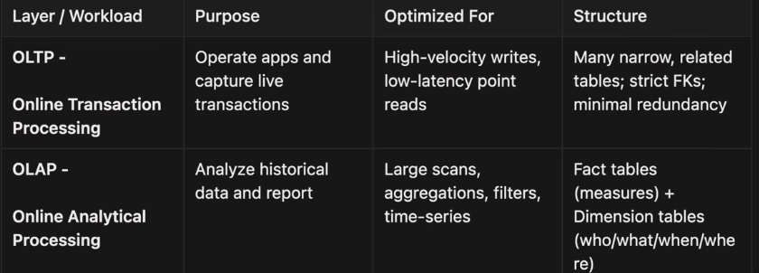

## Windows Function
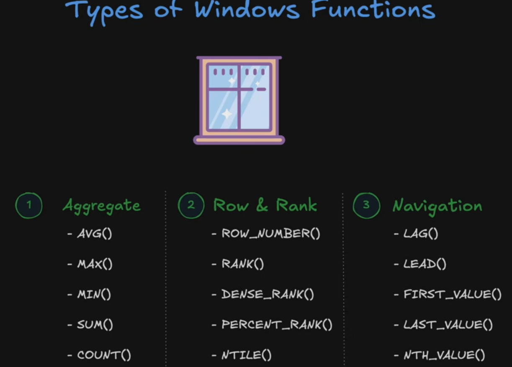

## Nested Data
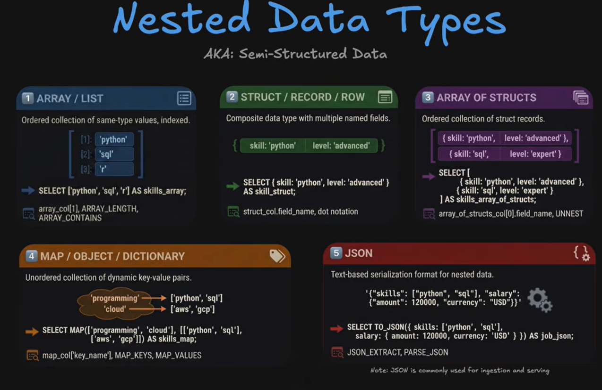
- Array/List
- Struct/record/row
- Array of Struct (orderd collection of struct records) (lebih sering ditemui)
- MAP/OBJECT/DISCT (unordered collection. mengandung key dan values)
- JSON 