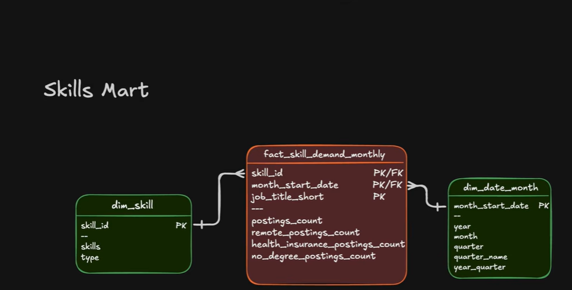
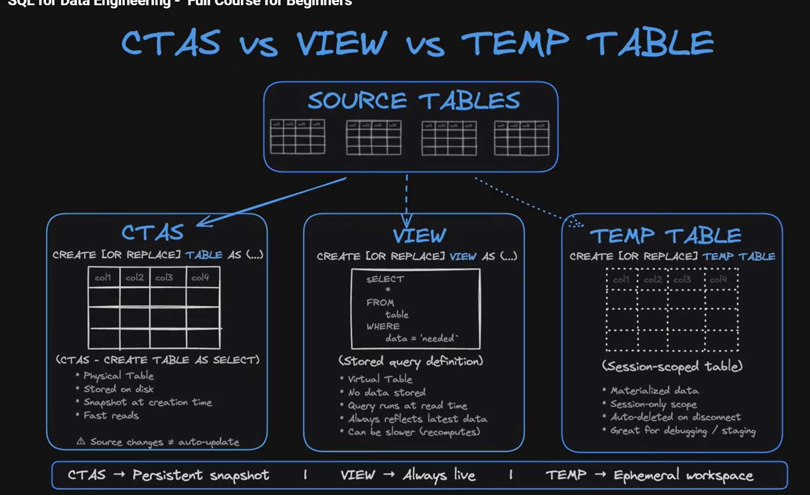

# Dimensional Mart
**Gabungan dari dim_skill dan dim_date_month (ini harus dibuat lagi)**

Why?
- Dimensional Mart mempertahankan _dimentional structure **(star schema)**_
Harapannya:
- Lebih cepat untuk analisa _time-series_
- smaller than row level data
- additive measure bisa lebih aman di _re agrregrate_

REMINDER LAGI 
